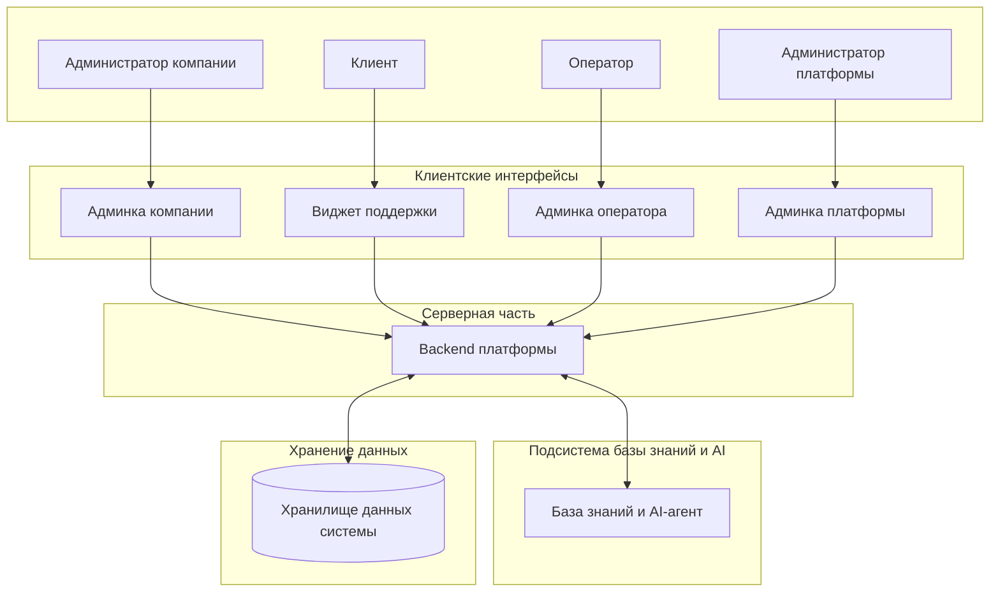
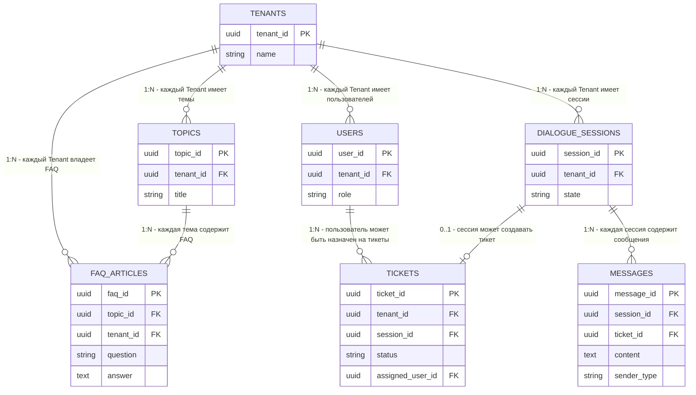
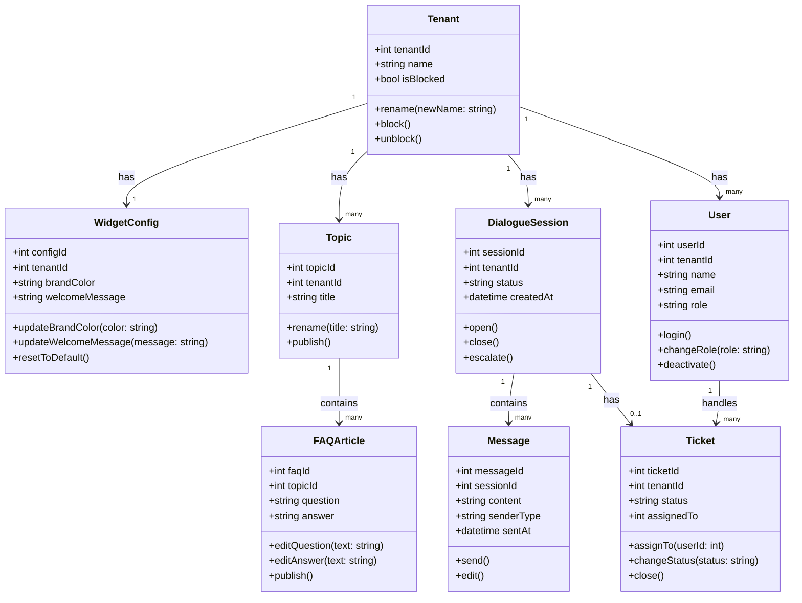
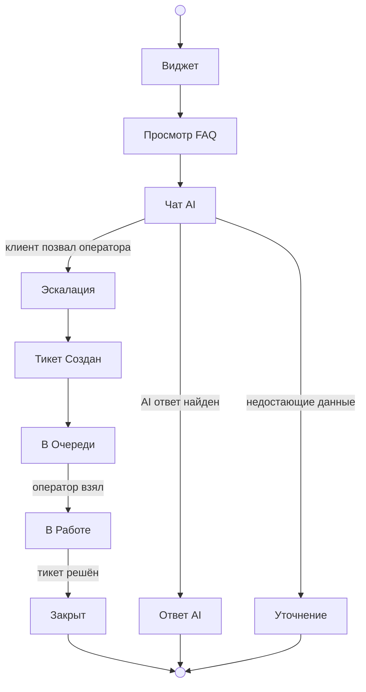
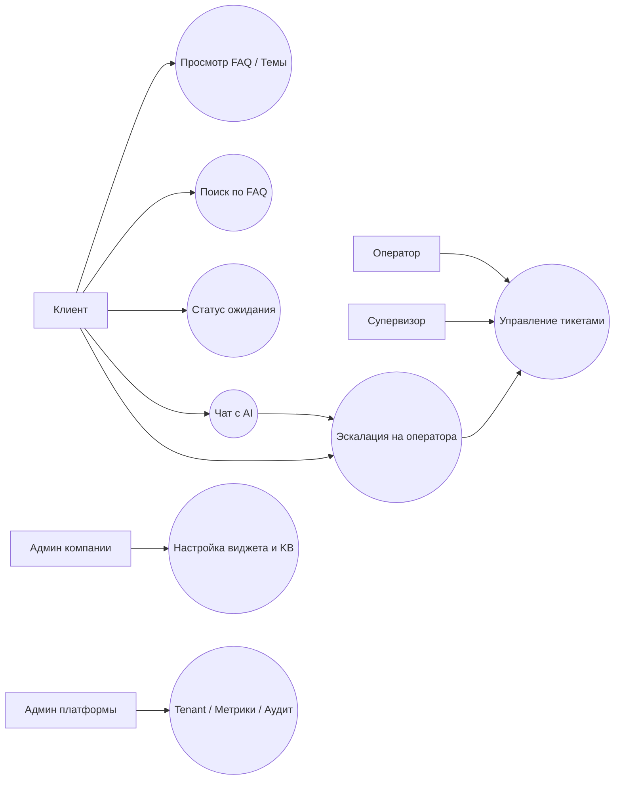

# SupportPulse

**SupportPulse** — это учебный client-server проект AI-платформы поддержки для сайтов компаний.  
Система позволяет встроить на сайт виджет поддержки с темами, FAQ и чатом, где пользователь может получить ответ от AI-ассистента на основе базы знаний компании, а при необходимости — переключиться на оператора через механизм эскалации в тикет.  

Проект разрабатывается как **MVP учебной командой** с фокусом на архитектуру, multi-tenant подход, работу с базой знаний и демонстрацию полного пользовательского сценария поддержки.

---

## Основная идея проекта

SupportPulse решает задачу быстрого запуска службы поддержки для компаний, которым невыгодно разрабатывать собственную инфраструктуру с нуля.

Пользователь открывает виджет на сайте компании, просматривает темы и FAQ, задаёт вопрос в чат и получает AI-ответ на основе материалов базы знаний. Если AI не может помочь или пользователь хочет перейти к человеку, система создаёт тикет, после чего оператор продолжает диалог в административной панели.

---

## MVP-сценарий

В рамках учебного MVP реализуется следующий основной сценарий:

1. Клиент открывает виджет поддержки на сайте
2. Просматривает темы и FAQ
3. Переходит в чат
4. Получает ответ от AI
5. При необходимости нажимает **«Позвать оператора»**
6. Система создаёт тикет
7. Оператор видит тикет в админке и берёт его в работу
8. Переписка продолжается в рамках одного обращения

---

## Основные возможности

### Клиентский виджет
- отображение тем поддержки
- отображение FAQ
- поиск по FAQ
- чат с AI
- кнопка вызова оператора
- статус ожидания ответа оператора

### AI и база знаний
- ответы на основе FAQ и загруженных материалов компании
- использование базы знаний конкретного tenant
- сохранение истории диалога
- передача контекста переписки в AI

### Эскалация и тикеты
- создание тикета при запросе оператора
- привязка чата к тикету
- назначение обращения в очередь
- работа оператора с обращением

### Админка оператора
- список тикетов
- фильтрация по статусу
- взятие тикета в работу
- просмотр истории переписки
- ответ клиенту в рамках тикета

### Админка компании
- настройка базы знаний
- управление FAQ
- загрузка файлов для обучения базы знаний
- настройка внешнего вида виджета

### Админ-функции платформы
- создание tenant-компаний
- блокировка tenant-компаний
- управление компаниями на уровне платформы

---

## Архитектурная идея

Система строится как **multi-tenant платформа**, где каждая компания-клиент является отдельным tenant.  
Это позволяет:
- логически изолировать данные компаний
- хранить отдельные FAQ, настройки и обращения
- использовать отдельную базу знаний для AI-ответов каждой компании

Верхнеуровнево проект включает:
- клиентский виджет
- админку оператора
- админку компании
- backend API
- AI/RAG-слой
- слой хранения данных

---

## Технологический стек

### Frontend
- **React**
- **Vite**
- **Tailwind CSS**
- **shadcn/ui**

Используется для:
- админки оператора
- админки компании

### Widget Frontend
- **Preact**
- **Vite**
- **Tailwind CSS**

Используется для:
- встраиваемого клиентского виджета на сайт

### Backend
- **Node.js**
- **Express**

Используется для:
- REST API
- бизнес-логики
- работы с тикетами, пользователями, FAQ и чатами
- интеграции с AI-слоем

### Database / Auth / Realtime / Storage
- **Supabase**

Используется для:
- хранения данных
- авторизации
- realtime-механизмов
- хранения файлов базы знаний

### AI / RAG
- **LangChain.js**
- **OpenAI API**
- **gpt-4o-mini**
- **text-embedding-3-small**

Используется для:
- генерации AI-ответов
- embedding текстов
- retrieval по базе знаний
- формирования ответа на основе контекста

### Deploy
- **Vercel** — frontend
- **Render / Railway** — backend

---
## Архитектура системы

Система состоит из клиентских интерфейсов, единого бэкенда, AI-подсистемы и изолированного хранилища данных.

---

## Схема базы данных (ER Diagram)

Основа системы — строгая изоляция данных по компаниям-клиентам (tenant_id).

---

## Доменная модель (Class Diagram)

Структура основных сущностей приложения и их базовые методы.

---

## Жизненный цикл обращения (Activity Diagram)

Процесс обработки запроса: от открытия виджета до закрытия тикета.

---

## Карта прецедентов (Use Case Diagram)

Взаимодействие ролей с функциональными модулями системы.

---
