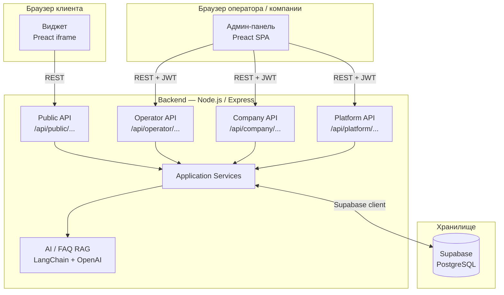
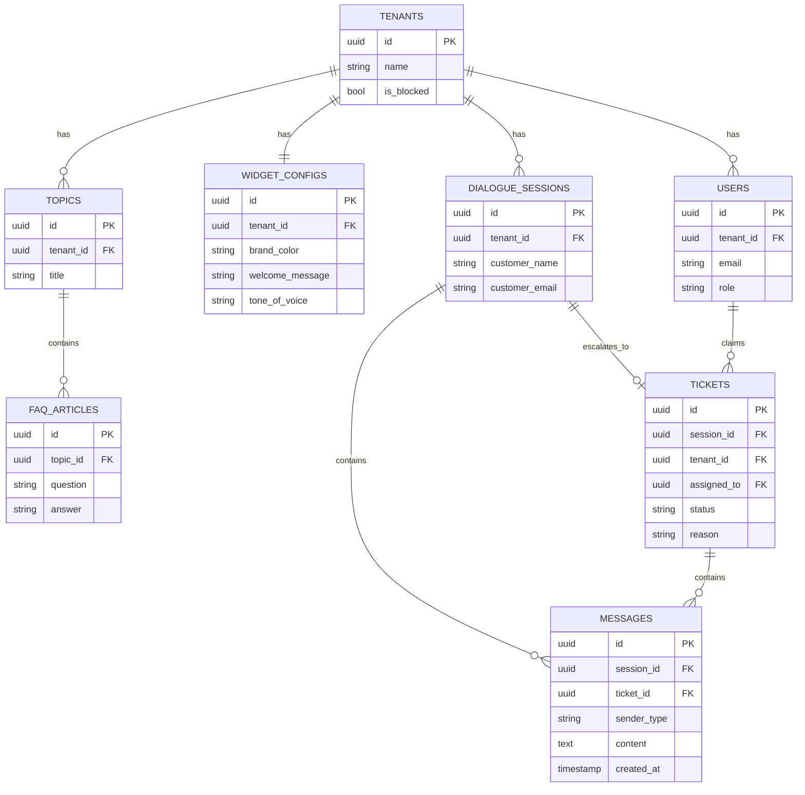
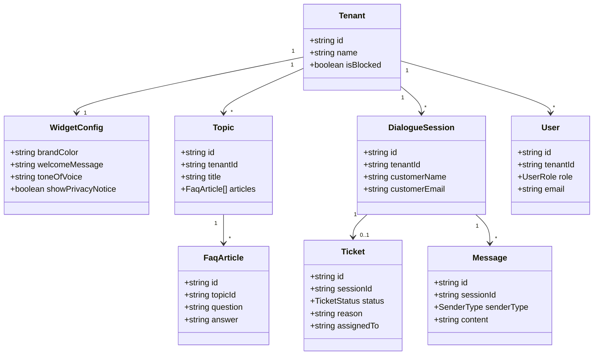
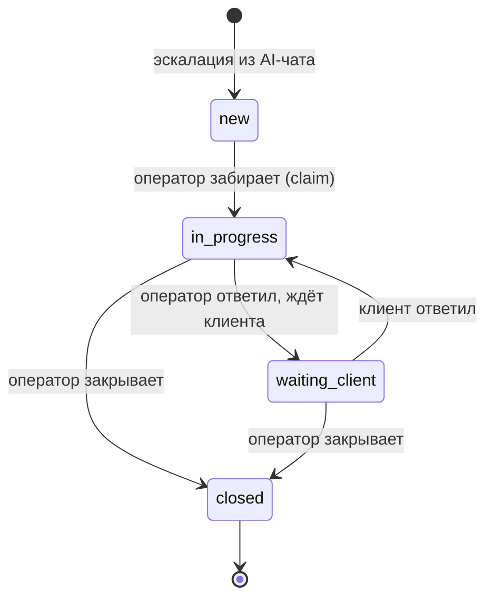
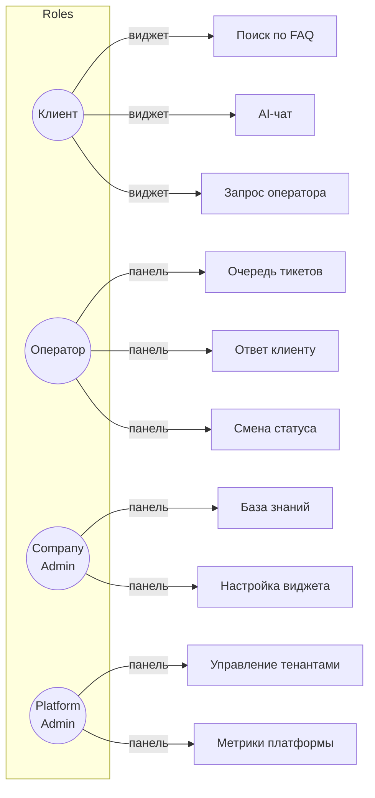

# SupportPulse

> AI-виджет поддержки с эскалацией на оператора — мультитенантная SaaS-платформа

## Главная идея

Компания встраивает на сайт один тег `<script>` и получает полноценный канал поддержки:

- клиент задаёт вопрос в виджете;
- AI отвечает мгновенно, опираясь на базу знаний (FAQ);
- если ответа нет или клиент просит оператора — создаётся тикет;
- оператор забирает тикет, переписывается с клиентом прямо в той же сессии;
- все данные изолированы по тенанту; платформа обслуживает сколько угодно компаний.

---

## MVP-сценарий

```
1. Клиент открывает сайт компании
       ↓
2. Загружается виджет (embed.js → iframe)
       ↓
3. Клиент вводит вопрос
       ↓
4. AI ищет ответ в базе знаний (FAQ RAG)
       ↓
5a. Найден ответ → AI отвечает клиенту
5b. Ответ не найден / клиент просит оператора → создаётся тикет
       ↓
6. Оператор видит тикет в очереди, забирает его (claim)
       ↓
7. Оператор переписывается с клиентом через панель
       ↓
8. Оператор закрывает тикет
```

---

## Ключевые возможности

| Область | Что умеет |
|---|---|
| **Виджет (клиент)** | Приветствие, FAQ-поиск, AI-чат, эскалация на оператора |
| **AI / база знаний** | FAQ RAG с токенизацией и префиксным поиском; LangChain + GPT-4o-mini при наличии ключа |
| **Эскалация / тикеты** | Создание тикета, статусная машина, история сообщений |
| **Операторская панель** | Очередь тикетов, принятие (claim), ответы, смена статуса |
| **Панель компании** | Управление темами и статьями FAQ, настройка виджета (цвет, тон, privacy) |
| **Панель платформы** | Создание тенантов, блокировка, базовые метрики |
| **Встраивание** | `GET /api/public/tenants/:id/embed.js` — один тег `<script>` |
| **Мультитенантность** | Каждая компания — изолированный тенант; данные не пересекаются |

---

## Архитектура



---

## ER-диаграмма



---

## Доменная модель



---

## Жизненный цикл тикета



---

## Роли и взаимодействие



---

## Стек технологий

| Слой | Технология |
|---|---|
| **Виджет (клиент)** | Preact + Vite (iframe embed) |
| **Админ-панель** | Preact + Vite (SPA) |
| **Backend** | Node.js + Express + TypeScript |
| **Архитектура** | Clean Architecture (domain / application / infrastructure) |
| **База данных** | Supabase (PostgreSQL) |
| **AI** | LangChain + OpenAI GPT-4o-mini; локальный fallback без ключа |
| **Авторизация** | JWT (access + refresh) + RBAC |
| **Встраивание** | Динамический `embed.js` → iframe |
| **Деплой** | Vercel (frontend) + Render / Railway (backend) |

---

## Быстрый старт

Смотри [SETUP.md](SETUP.md) — там пошаговая инструкция по локальному запуску, переменным окружения, демо-аккаунтам и API.
